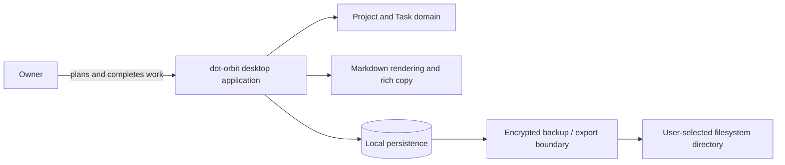

# System context

dot-orbit is a cross-platform Avalonia/.NET desktop application. It stores local data in SQLite encrypted by SQLite3MC and produces encrypted, cross-platform backups. Other architectural boundaries remain intentionally undecided.

## Required boundaries

- **Presentation** renders the six views and the inspector.
- **Domain** owns completion derivation, Category inheritance, Today membership, and ordering invariants.
- **Persistence** stores records and every independent ordering scope atomically in SQLite encrypted by SQLite3MC.
- **Backup** automatically creates encrypted, validated, cross-platform recovery points without a plaintext intermediate copy. Its destination is a user-selected filesystem directory that may be managed by an external sync service.
- **Synchronisation** is outside the first-release system boundary. A synced backup folder does not provide live record synchronisation or conflict resolution.
- **Markdown** renders trusted local source safely and produces rich clipboard output.
- **Search** indexes archived Project and Task content.

## Architecture questions to decide before implementation

- Export and schema-migration strategy.
- Optional post-first-release biometric unlock and operating-system credential-store integration.
- Markdown library and HTML sanitisation boundary.
- Search implementation.
