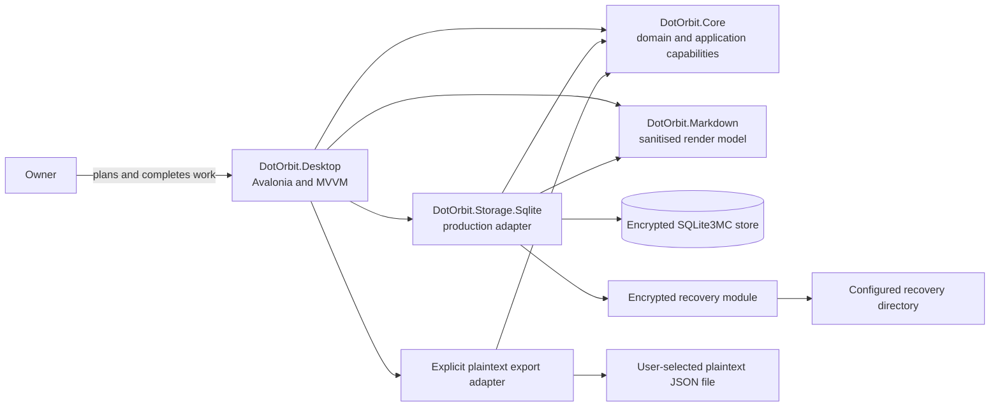

# System context

dot-orbit is a cross-platform Avalonia/.NET desktop application implemented as a pragmatic modular monolith. Capability-oriented domain and application behaviour lives in a reusable core, real I/O is placed behind explicit seams, and Avalonia MVVM remains at the desktop presentation edge. SQLite3MC provides encrypted local persistence and encrypted, cross-platform backups. See [ADR 0006](../adr/0006-pragmatic-modular-monolith.md).

## Module and dependency direction

- **`DotOrbit.Core`** contains capability-oriented domain and application slices. It depends only on the .NET base class libraries and owns the interfaces required from persistence and other I/O.
- **`DotOrbit.Storage.Sqlite`** implements the encrypted persistence interface, migrations, search, and recovery behaviour. It depends on `DotOrbit.Core`.
- **`DotOrbit.Markdown`** owns the single sanitised Markdown render model and plain-text projection used by preview, clipboard, and archive search.
- **`DotOrbit.Desktop`** contains Avalonia views, view models, desktop integration, and the composition root. It references `DotOrbit.Core` and wires `DotOrbit.Storage.Sqlite` into the application.
- **Markdown and plaintext export adapters** are consumed at the desktop, persistence, or application edge. They may depend inward on core-owned contracts, but `DotOrbit.Core` remains BCL-only and never depends on a Markdown parser, renderer, or output adapter.
- **Tests** align with the production projects: core unit tests, SQLite3MC integration tests using real temporary encrypted databases, and focused desktop tests plus supported-runtime verification.

No production module depends on the desktop presentation module. A future mobile application can provide a separate presentation and composition root over `DotOrbit.Core` without requiring the first-release desktop UI to be portable.

## Required boundaries

- **Presentation** uses Avalonia MVVM to render the seven primary views, the Bin utility, and the inspector. View models expose presentation state and translate intent but do not own domain rules or SQL.
- **Core** owns completion derivation, Category inheritance, Today membership, ordering invariants, and the application actions that change them atomically.
- **Persistence** is a core-owned seam implemented by the SQLite3MC adapter. It stores records and every independent ordering scope atomically without exposing SQL records or query providers to callers.
- **Encrypted store lifecycle** owns creation, opening, validation, migration, passphrase rotation, and closing while hiding cipher and key-derivation configuration from callers.
- **Recovery** automatically creates encrypted, validated, cross-platform recovery points without a plaintext intermediate copy. Its destination is a user-selected filesystem directory that may be managed by an external sync service.
- **Plaintext export** is a separate, explicit manual operation to a user-selected JSON file. It is unencrypted, does not use automatic-backup retention, and does not default to the configured recovery directory.
- **Synchronisation** is outside the first-release system boundary. A synced backup folder does not provide live record synchronisation or conflict resolution.
- **Interchange** is not part of the current implementation graph and is not scaffolded in advance. A future tool-neutral adapter may depend inward on core-owned application interfaces for explicitly copying a generated planning prompt or active-work snapshot and importing untrusted change proposals through validation, preview, and explicit approval. Transcript parsing, file access, and AI-provider integration remain outside the application boundary.
- **Markdown** treats all source as untrusted and produces one sanitised render model for preview, rich clipboard output, archive-search text, and plain-text fallback. Raw HTML and automatic remote-image loading are disabled.
- **Search** indexes archived Project and Task content.

## Deferred architecture questions

- Optional post-first-release biometric unlock and operating-system credential-store integration.
- Agent-interchange conflict handling and operation vocabulary as later versions evolve.
